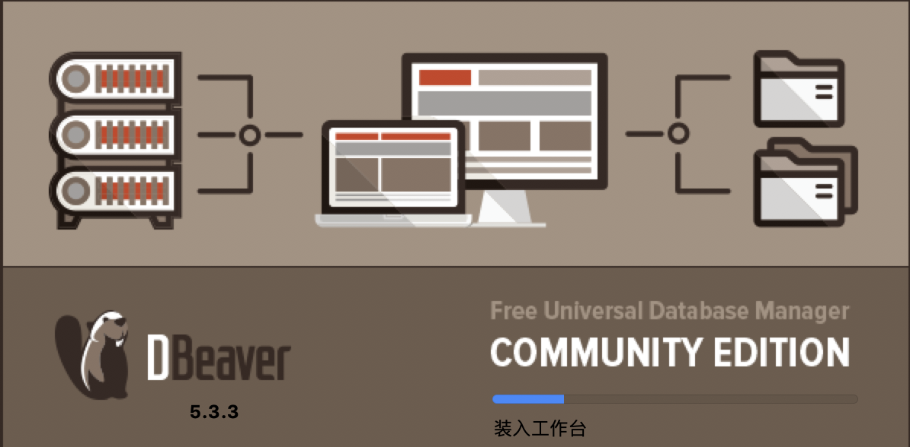
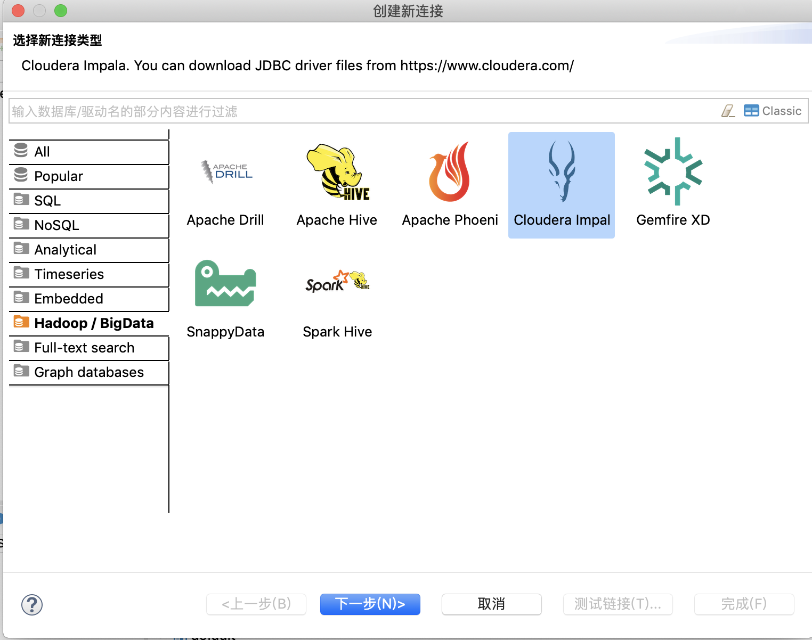

使用DBeaver访问Kerberos环境下配置impala（Mac版本）
==================================================

1.  要编写清单，只需点击此处并开始键入。

    点击“dbeaver-ce-5.3.3-macos.dmg”安装，将DBeaver图标拖入到右边的Application的文件夹里

    

2.  从访达进入应用程序，找到DBeaver，右键点击选择“显示包内容”。

    

3.  将“dbeaver.ini”，“krb5.conf”两个文件放到/Applications/DBeaver.app/Contents/Eclipse

    

4.  从访达进入应用程序，找到实用工具里的“Ticket Viewer”，打开

    

5.  点击“添加身份”，输入身份 <finance/remote@SGMW.COM>，和密码

    

    

6.  从访达进入应用程序，找到DBeaver，打开

    

7.  点“数据库”、“创建新连接”、“Hadoop/Big Data”，“选Cloudera Impala”，点下一步

    

8.  点“编辑驱动设置”填入JDBC URL：

    jdbc:impala://10.1.126.235:21050/dm_finance;AuthMech=1;KrbHostFQDN=cnwulcdhnode01;KrbServiceName=impala;

    

    

9.  在库的位置，点“添加文件”，把“ImpalaJDBC41.jar”添加进去，点“找到类”，点确定

    

10. 点“测试链接(T)…”

    
