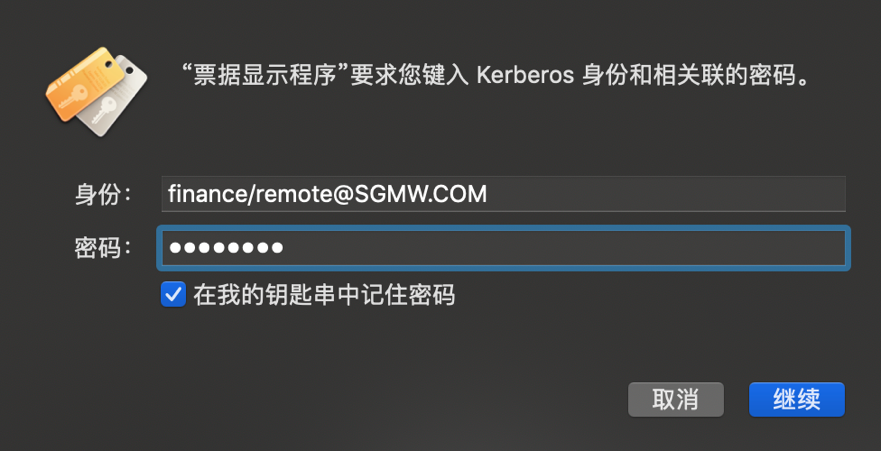
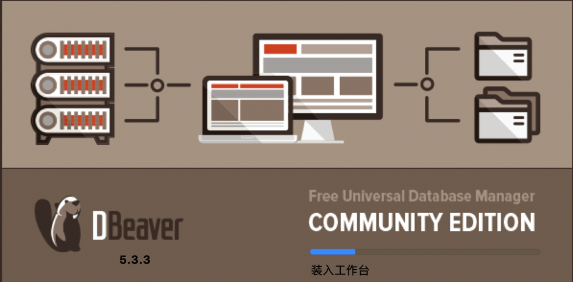
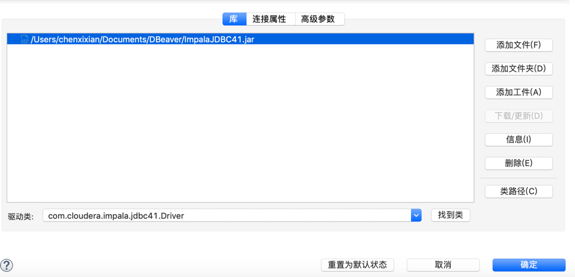

使用DBeaver访问Kerberos环境下配置impala（Mac版本）
==================================================

1.  要编写清单，只需点击此处并开始键入。

    点击"dbeaver-ce-5.3.3-macos.dmg"安装，将DBeaver图标拖入到右边的Application的文件夹里

    {width="6.26875in"
    height="3.0506944444444444in"}

2.  从访达进入应用程序，找到DBeaver，右键点击选择"显示包内容"。

    {width="6.26875in"
    height="3.5215277777777776in"}

3.  将"dbeaver.ini"，"krb5.conf"两个文件放到/Applications/DBeaver.app/Contents/Eclipse

    {width="6.26875in"
    height="3.1840277777777777in"}

4.  从访达进入应用程序，找到实用工具里的"Ticket Viewer"，打开

    {width="5.875694444444444in"
    height="3.825353237095363in"}

5.  点击"添加身份"，输入身份
    [[finance/remote\@SGMW.COM]{.underline}](mailto:finance/remote@SGMW.COM)，和密码

    {width="5.875694444444444in"
    height="2.5964490376202973in"}

    {width="5.875694444444444in"
    height="3.0097714348206472in"}

6.  从访达进入应用程序，找到DBeaver，打开

    {width="6.26875in"
    height="3.0868055555555554in"}

7.  点"数据库"、"创建新连接"、"Hadoop/Big Data"，"选Cloudera
    Impala"，点下一步

    {width="6.26875in"
    height="4.944444444444445in"}

8.  点"编辑驱动设置"填入JDBC URL：

    jdbc:impala://10.1.126.235:21050/dm\_finance;AuthMech=1;KrbHostFQDN=cnwulcdhnode01;KrbServiceName=impala;

    {width="6.26875in"
    height="4.906944444444444in"}

    {width="6.26875in"
    height="4.967361111111111in"}

9.  在库的位置，点"添加文件"，把"ImpalaJDBC41.jar"添加进去，点"找到类"，点确定

    {width="6.26875in"
    height="3.0229166666666667in"}

10. 点"测试链接(T)..."

    {width="6.26875in"
    height="4.204861111111111in"}
